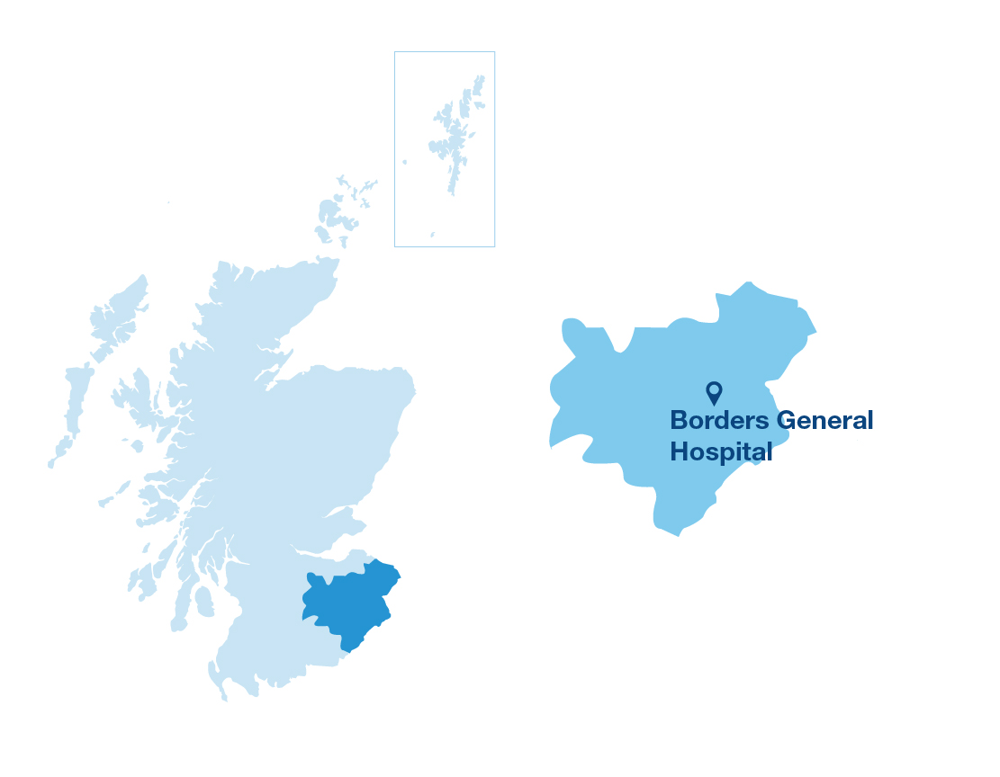

```{r include=FALSE}

# load libraries
library(tidyverse)
library(janitor)
library(here)
library(ggridges)
library(plotly)

# read in data
hb_data <- read_tsv(here('raw_data/opendata_inc9620_hb.csv')) %>% 
  clean_names()

sco_data <- read_tsv(here('raw_data/opendata_inc9620_scotland.csv')) %>% 
  clean_names()

comb_data <- read_tsv(here('raw_data/opendata_inc1620comb_hb.csv')) %>% 
  clean_names()

```

```{r include=FALSE}

# filter the data down to NHS Borders only
borders_data <-  hb_data %>% 
  filter(hb == "S08000016")

# years covered in dataset
unique(borders_data$year)

# list of different cancer types
unique(borders_data$cancer_site)

# calculate the number of cancer cases
borders_data %>% 
  filter(cancer_site == "All cancer types") %>% 
  filter(sex == "All") %>% 
  select(incidences_all_ages) %>% 
  sum()

# calculate the gender split
borders_data %>% 
  filter(cancer_site == "All cancer types") %>% 
  filter(sex == "Female") %>% 
  select(incidences_all_ages) %>% 
  sum()

borders_data %>% 
  filter(cancer_site == "All cancer types") %>% 
  filter(sex == "Male") %>% 
  select(incidences_all_ages) %>% 
  sum()


```


# <span style="color: #2694D3;">Looking at cancer incidencies by gender</span>

According to the data from 1996 to 2020 there were a total of __18,091__ cancer cases across NHS Borders. Looking here at the gender split you can get an idea of the pattern of cases over time. This data sample contained __9113 females__ and __8978 males__, so there is no real bias either way in terms of the graph below.


```{r echo=FALSE, message=FALSE}
gender_chart <- borders_data %>%
  filter(cancer_site == "All cancer types" & sex != "All") %>% 
  group_by(cancer_site, year, incidences_all_ages) %>% 
  ggplot() +
  geom_point() +
  aes(x = year, y = incidences_all_ages, colour = sex) +
  geom_smooth(se = FALSE, size = 0.5, colour = "#2694D3") +
  labs(
    x = "\nYear",
    y = "Number of cancer cases",
    #title = "Cancer cases by gender",
    caption = "Data from opendata.nhs.scot") +
  facet_wrap(~sex) +
  theme_minimal() +
  theme( 
    legend.position = "none")

ggplotly(gender_chart)
```

# <span style="color: #2694D3;">Cancer Site breakdown across NHS Borders</span>

If we breakdown the cases by cancer type we can see there are 51 different types of cancer recorded in the Borders region. Obviously some cancers depend on gender but we can see here that some have a big effect on both men and women.

```{r echo=FALSE}
borders_data %>%
  filter(sex != "All") %>% 
  filter(cancer_site != "All cancer types") %>% 
  ggplot() +
  geom_col(aes(x = incidences_all_ages, y = cancer_site, fill = sex)) +
  labs(
    x = "\nIncidences (1996 - 2020)",
    y = "Type of cancer",
    #title = "Cancer cases by gender",
    caption = "Data from opendata.nhs.scot") +
  facet_grid(~sex) +
  theme_minimal() +
  theme(text = element_text(size=8),
    legend.position = "none")
```

Looking closer at the data we can see which cancers are having the biggest effect across the Borders. 


```{r echo=FALSE, message=FALSE}
borders_data %>%
  filter(sex != "All") %>% 
  filter(cancer_site != "All cancer types") %>% 
  filter(incidences_all_ages >= 33) %>% 
  ggplot() +
  geom_col(aes(x = incidences_all_ages, y = cancer_site, fill = sex)) +
  labs(
    x = "\nIncidences (1996 - 2020)",
    y = "Type of cancer",
    #title = "Cancer cases by gender",
    caption = "Data from opendata.nhs.scot") +
  #facet_grid(~sex) +
  theme_minimal() +
  theme(text = element_text(size=12),
        legend.position = "none")
    #panel.grid = element_blank())

```

# <span style="color: #2694D3;">Conclusion</span>

There seems to be an overall upward trend in the number of cases. If we know what the worst offenders are more resources could be channelled into targeted screenings, or general awareness campaigns around certain cancers to try to see if catching things early can help to save lives. Skin cancer in particular seems to be an issue in the Borders. It may also be worth looking to see if the same trends exists in other areas of Scotland or is there a particular reason certain cancers are more prominent in the Borders.


```{r include=FALSE}
borders_data %>%
  filter(sex != "All") %>% 
  filter(cancer_site != "All cancer types") %>% 
  ggplot() +
  geom_density_ridges(aes(x = incidences_all_ages, y = cancer_site, fill = sex)) +
  facet_grid(~sex)
```

